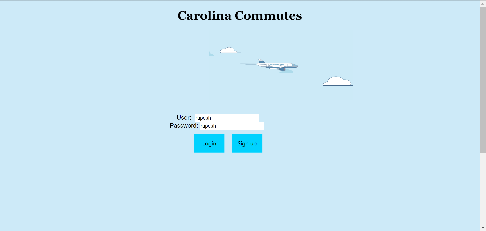

# Carolina Commutes - Flight Trip Planner - For COMP 426

### Made using vanilla JS and J-Query with Rest API backend with google maps API for location tracking. 

**Disclaimer - Database is populated using artificially created data, you cannot book an actual flight using this tool** ** 

## Features:
1. Create and delete user accounts
1. Check if flights exist between 2 cities and book single or round trips. 
1. Book flights with a single click and check itinerary in your account portal. 
1. Check airport locations of departure and arrival airports.
1. Website follows a first come first serve random seat booking busniess model.  

*** 
Made as a COMP 426 Final Project
